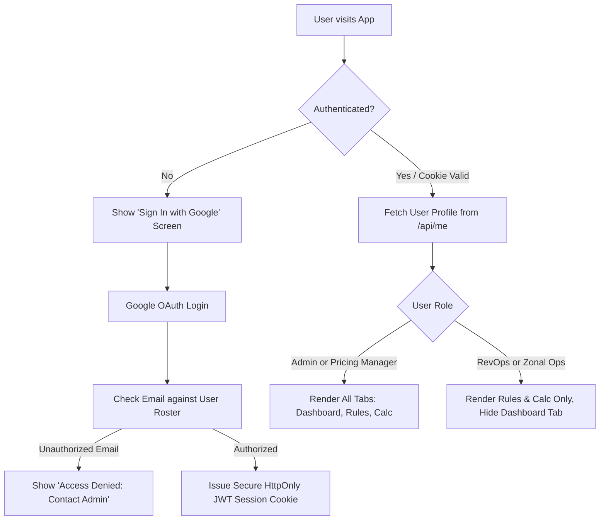

# Multi-User Access Control (Authentication & RBAC) Implementation Plan

## 1. Team Structure & Access Overview

This document outlines the multi-user authentication and role-based access control (RBAC) architecture for the **Daily Pricing Dashboard / Target Date Factor Automator**.

### Team Breakdown (14 Users Total):
1. **Admin (1 user - You / RevOps Lead)**:
   - **Full Access** across all tools: Daily Pricing Dashboard, Rule Parameters, TDF Calculator, and User/Access Management.
2. **Pricing Managers (8 users)**:
   - **Full Access**: Daily Pricing Dashboard (live sheets portfolio data), Rule Parameters (rule generation & export), TDF Calculator, and Metabase link.
3. **RevOps Team (3 users including Admin)**:
   - **Focused Access**: **Rule Parameters** & **TDF Calculator**.
   - Daily Pricing Dashboard tab is hidden from the sidebar to streamline their workflow.
4. **Zonal Ops Team (3 users)**:
   - **Focused Access**: **Rule Parameters** & **TDF Calculator**.
   - Daily Pricing Dashboard tab is hidden from the sidebar.

---

## 2. Access Matrix by Role

| Tab / Capability | Admin | Pricing Manager (8 users) | RevOps Team (3 users) | Zonal Ops Team (3 users) |
| :--- | :---: | :---: | :---: | :---: |
| **Daily Pricing Dashboard** (Portfolio Rates) | ✅ Full | ✅ Full | ❌ Hidden | ❌ Hidden |
| **Generate Hawkeye Rules from Dashboard** | ✅ Yes | ✅ Yes | ❌ Hidden | ❌ Hidden |
| **Rule Parameters** (Fixed & Split Multipliers) | ✅ Full | ✅ Full | ✅ Full | ✅ Full |
| **Joined Hotel IDs (100-hotel chunks)** | ✅ Full | ✅ Full | ✅ Full | ✅ Full |
| **Copy for Google Sheets & Download CSV** | ✅ Yes | ✅ Yes | ✅ Yes | ✅ Yes |
| **TDF Calculator** (P0–P5 price breakdown) | ✅ Full | ✅ Full | ✅ Full | ✅ Full |
| **Metabase TDF Dashboard Link** | ✅ Yes | ✅ Yes | ✅ Yes | ✅ Yes |
| **Default Landing Tab** | Dashboard | Dashboard | Rule Parameters | Rule Parameters |

---

## 3. User Directory Design (Google Sheet or Config File)

User rosters and roles can be maintained directly in a new Google Sheets tab named **`Access Control`** in your portfolio spreadsheet (or stored in a secure server-side `users.json` file):

| Email | Full Name | Role | Active |
| :--- | :--- | :--- | :---: |
| `admin@yourcompany.com` | Head of Revenue (Admin) | `Admin` | `TRUE` |
| `pm1@yourcompany.com` | Pricing Manager 1 | `Pricing Manager` | `TRUE` |
| `pm2@yourcompany.com` | Pricing Manager 2 | `Pricing Manager` | `TRUE` |
| `pm3@yourcompany.com` | Pricing Manager 3 | `Pricing Manager` | `TRUE` |
| `pm4@yourcompany.com` | Pricing Manager 4 | `Pricing Manager` | `TRUE` |
| `pm5@yourcompany.com` | Pricing Manager 5 | `Pricing Manager` | `TRUE` |
| `pm6@yourcompany.com` | Pricing Manager 6 | `Pricing Manager` | `TRUE` |
| `pm7@yourcompany.com` | Pricing Manager 7 | `Pricing Manager` | `TRUE` |
| `pm8@yourcompany.com` | Pricing Manager 8 | `Pricing Manager` | `TRUE` |
| `revops1@yourcompany.com` | RevOps Member 1 | `RevOps` | `TRUE` |
| `revops2@yourcompany.com` | RevOps Member 2 | `RevOps` | `TRUE` |
| `zonal1@yourcompany.com` | Zonal Ops 1 | `Zonal Ops` | `TRUE` |
| `zonal2@yourcompany.com` | Zonal Ops 2 | `Zonal Ops` | `TRUE` |
| `zonal3@yourcompany.com` | Zonal Ops 3 | `Zonal Ops` | `TRUE` |

*Note: Role matching is case-insensitive. Setting `Active` to `FALSE` instantly revokes access for offboarded employees.*

---

## 4. Technical Architecture & Data Flow

---

## 5. Technical Implementation Blueprint

### A. Backend (`server.js`)
1. **Dependencies**: `jsonwebtoken`, `cookie-parser`.
2. **Authentication Endpoints**:
   - `GET /auth/google/user`: Initiates OAuth 2.0 flow requesting `openid`, `profile`, and `email` scopes.
   - `GET /auth/google/callback`: Verifies auth code, retrieves Google user profile, validates email against the roster, issues a cryptographically signed `HttpOnly` JWT session cookie, and redirects to `/`.
   - `GET /auth/logout`: Clears the session cookie and redirects to `/`.
   - `GET /api/me`: Returns the authenticated user's profile (`{ email, name, picture, role }`).
3. **API Protection Middleware**:
   - `requireAuth`: Rejects unauthenticated requests to `/api/*` with 401.
   - `requireRole`: Protects `/api/sheet-data` so only `Admin` and `Pricing Manager` roles can pull the full portfolio sheets data. If a `RevOps` or `Zonal Ops` user requests it, returns 403 Forbidden.

### B. Frontend (`index.html` & `app.js`)
1. **Header User Badge**:
   - Displays user avatar/initials, full name, colored role badge (`Admin`, `Pricing Manager`, `RevOps`, `Zonal Ops`), and a **Sign Out** button.
2. **Role-Based Tab Visibility**:
   - For `RevOps` and `Zonal Ops`:
     - Hide the `Daily Pricing Dashboard` tab from the sidebar.
     - Automatically land and activate `Rule Parameters` (`tab-rules`).
     - `Rule Parameters` and `TDF Calculator` are fully functional.
   - For `Admin` and `Pricing Manager`:
     - All tabs are visible and interactive. Defaults to `Daily Pricing Dashboard`.
3. **Branded Sign-In Screen**:
   - Renders a clean sign-in screen when no active session exists with a "Sign in with Google Workspace" button.

---

## 6. Verification Plan

1. **API Endpoints Verification**:
   - `/api/me` without cookie $\rightarrow$ `401 Unauthorized`.
   - `/api/sheet-data` as `Zonal Ops` or `RevOps` $\rightarrow$ `403 Forbidden`.
   - `/api/sheet-data` as `Pricing Manager` or `Admin` $\rightarrow$ `200 OK`.
2. **End-to-End Browser Testing**:
   - Login as `Admin`: verify all 3 tabs visible.
   - Login as `Pricing Manager`: verify all 3 tabs visible with full rule generation.
   - Login as `RevOps`: verify `Daily Pricing Dashboard` tab is hidden, lands on `Rule Parameters`.
   - Login as `Zonal Ops`: verify `Daily Pricing Dashboard` tab is hidden, lands on `Rule Parameters`.
   - Sign out: session cleared, returns to login screen.
